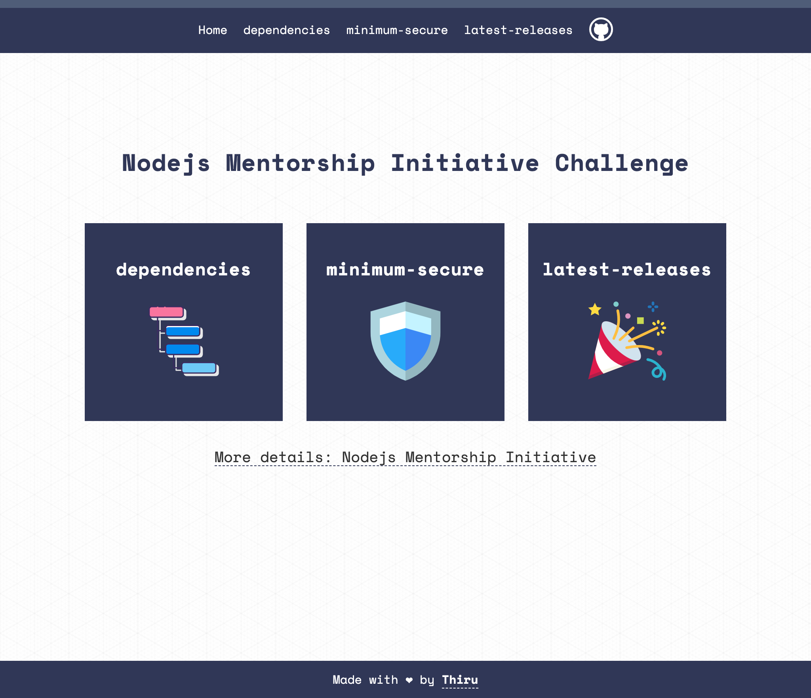

# Node.js Examples Initiative Challenge

> **The Node.js Examples Initiative is looking for a qualified mentee to join the initiative.**

## Installation Instructions

### To run the application

```bash
npm run start
```

### To run the tests

```bash
npm run test
```

## Application screenshots

|                     |       |
| ----------------------------------------------------- | ------------------------------------------------------- |
|  |  |

---

### Instructions from Challenge

## This challenge will test your ability to:

1. Write code in Node.js beyond "Hello World"
2. Identify and write useful tests
3. Fetch data from an API and serve JSON content as response
4. Render out data using dynamic template files
5. Add the correct license to your project
6. Follow guidelines and instructions

## Requirements:

- Use the API [here](https://nodejs.org/dist/index.json)
- Licensed as MIT
  - In `package.json`
  - License file included
- Use the following packages:
  - `bent` for all requests
  - `semver` for version comparisons and other operations
  - `hbs` to render handlebars templates

## The Challenge

### Use Express.js to create three (3) routes that consume an API in the following ways:

- Routes

  1. `GET - /dependencies`

     This will retrieve all dependencies from the `package.json` and render HTML using handlebars.

     #### Example Response

     ```
      <!DOCTYPE html>
      <html lang="en" dir="ltr">
        <head>
          <meta charset="utf-8">
          <title></title>
        </head>
        <body>
          <ul>
              <li>bent - ^7.3.7</li>
              <li>express - ^4.17.1</li>
              <li>hbs - ^4.1.1</li>
              <li>semver - ^7.3.2</li>
          </ul>
        </body>
      </html>
     ```

  2. `GET - /minimum-secure`

     This will return the minimum secure version for each release line as JSON. In other words, what is the highest version of each line that has `security: true`.

     #### Example Response

     ```
     {
        "v0": {
            "version": "v0.12.17",
            "date": "2016-10-18",
            "files": [],
            "npm": "2.15.1",
            "v8": "3.28.71.19",
            "uv": "1.6.1",
            "zlib": "1.2.8",
            "openssl": "1.0.1u",
            "modules": "14",
            "lts": false,
            "security": true
        },
        "v4": {
            "version": "v4.9.0",
            "date": "2018-03-28",
            "files": [],
            "npm": "2.15.11",
            "v8": "4.5.103.53",
            "uv": "1.9.1",
            "zlib": "1.2.11",
            "openssl": "1.0.2o",
            "modules": "46",
            "lts": "Argon",
            "security": true
        } ...

     ```

  3. `GET - /latest-releases`

     This will return the latest release version in each release line as JSON.

     #### Example Response

     ```
     {
       "v14": {
           "version": "v14.7.0",
           "date": "2020-07-29",
           "files": [],
           "npm": "6.14.7",
           "v8": "8.4.371.19",
           "uv": "1.38.1",
           "zlib": "1.2.11",
           "openssl": "1.1.1g",
           "modules": "83",
           "lts": false,
           "security": false
       },
       "v13": {
           "version": "v13.14.0",
           "date": "2020-04-28",
           "files": [],
           "npm": "6.14.4",
           "v8": "7.9.317.25",
           "uv": "1.37.0",
           "zlib": "1.2.11",
           "openssl": "1.1.1g",
           "modules": "79",
           "lts": false,
           "security": false
       } ...

     ```

* Tests

  Each of the above endpoints should have its own tests. Use the provided `test/index.js` file to get started and see below for example output.

  - Test Requirements:

    - Write tests using `tape`
    - Mock http requests during tests by using `nock` to prevent live requests

```
# should get dependencies
  ok 1 should contain bent
  ok 2 should contain express
  ok 3 should contain hbs
# should get minimum secure versions
  ok 4 v0 version should match
  ok 5 v4 version should match
# should get latest-releases
  ok 6 v14 version should match
  ok 7 v13 version should match
```

## Instructions:

### How to attempt this challenge

1. Clone this repo
2. Create a new repo in your account and note the git url
3. Set the origin of the clone to the url of the previous step: `git remote set-url origin ${your repo url}`
4. Solve the challenge
5. Push your changes
